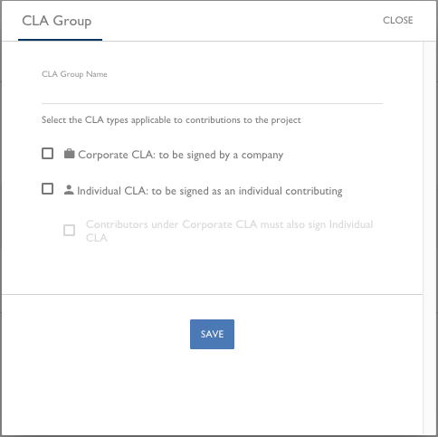

# Add a CLA Group

A CLA group defines:

* What CLA types your project requires for pull requests or push submissions—the agreement types are for corporate or individual CLAs

* What CLAs and their versions are used for the contributors

* What GitHub repositories, Gerrit instances, or both enforce CLA monitoring

As a project manager, you use the CLA Management Console to add and name a CLA group for your project. A CLA group gives you the flexibility to handle different CLA requirements for various GitHub repositories and Gerrit instances.

**Do these steps**:

1. [Sign in](Sign-In-to-the-CLA-Management-Console.md).

1. Click a **project** of interest.

   The project page appears.

   A message informs you that your project needs a CLA group. A CLA group defines one or more CLA types that contributors must sign before they can contribute to a project. 

1. Click **ADD CLA GROUP**.

1. Complete the dialog options:

   

   a. Enter a **CLA Group Name**.

      The CLA Group Name indicates that a project has one or more CLAs (Individual CLA, Corporate CLA, or both). Consider matching the CLA group name to the project name for easy identification.

   b. Select the CLA types that you want applied to contributions to the project:

      * **Corporate CLA: to be signed by a company** - This Corporate CLA must be signed by the CCLA signatory for your company. This person has authority to enter into legal contracts on behalf of the corporation.

      * **Individual CLA: to be signed as an individual contributing** - A developer who is not contributing on behalf of any company signs this Individual CLA. This individual is contributing to a project on their own behalf. Selecting this type automatically enables the "Contributors under Corporate CLA must also sign Individual" CLA type.

         * **Contributors under Corporate CLA must also sign Individual CLA** - Employees (developers) of a company use this agreement. A Corporate CLA may not remove the need for every employee to sign their own Individual CLA as an individual. This option covers both owned contributions and not-owned contributions by the corporation signing the Corporate CLA.

   c. Click **SAVE**.

   The CLA group that you added and the CLA types that you specified appear under CLA Groups.

### Next Steps:

* [Add Contributor License Agreements](Add-Contributor-License-Agreements.md)

* [Add GitHub Repositories to CLA Monitoring or Remove Them From CLA Monitoring](Add-GitHub-Repositories-to-CLA-Monitoring-or-Remove-Them-From-CLA-Monitoring.md)

   or

* [Add Gerrit Instances to CLA Monitoring or Delete Them From CLA Monitoring](Add-Gerrit-Instances-to-CLA-Monitoring-or-Delete-Them-From-CLA-Monitoring.md)

* (Optional) [Manage CLA Group Details](Manage-CLA-Group-Details.md)