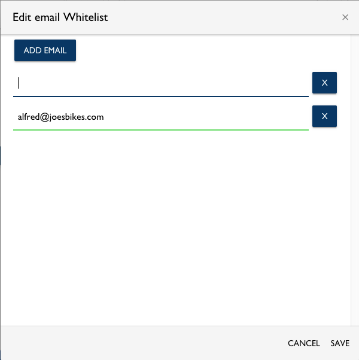

# Whitelist Contributors

Whitelists are lists of domain names, email addresses of individuals, GitHub usernames, or GitHub organization names who are authorized to contribute under a signed CLA. As a CLA manager, you allow contributions to your company projects by using any whitelist:

* Domain Whitelist allows entities to contribute under any email address under that domain name.

* Email Whitelist allows entities to contribute under an individual email address.

* GitHub Whitelist allows entities to contribute under a GitHub username.

* GitHub Organization Whitelist allows entities to contribute under a GitHub organization name.

Each whitelist applies to the project for which the company has signed a Corporate CLA. The CLA application checks all the whitelists for allowing contributions to a company project. A contributor only needs to be on one whitelist. Contributors can use EasyCLA to send email requests to be associated (whitelisted) with the company.

*Multiple CLA managers cannot whitelist the same domain and sign a CCLA for the same company.*

Consider the following conventions for email addresses:

* A Corporate CLA requires a domain name, an @company email address, or both.

* An Individual CLA that is tied to your employer requires an @company email address. (You do not whitelist a contributor who is not tied to any employer or company.)

**Do these steps:**

1. [Sign in](Sign-In-to-the-CLA-Corporate-Console.md).

   The CLA Corporate Console appears and shows Companies.

1. Click a **company** of interest.

   The CLA Corporate Console appears and shows Signed CLAs.

   

1. Click a **CLA**.

   The whitelists appear:

   

1. Decide which whitelist you want to edit:

    + [Domain Whitelist, Email Whitelist, or GitHub Whitelist](#domain-whitelist--email-whitelist--or-github-whitelist)
    + [GitHub Organization Whitelist](#github-organization-whitelist)

### Domain Whitelist, Email Whitelist, or GitHub Whitelist

The corresponding Edit *domain/email/github* Whitelist dialog lets you add, edit, and delete values to a whitelist so that employees (developers) can be associated to the company. An example domain name value is joesbikes.com. A wildcard whitelists the domain and all subdomains, for example: \*.joesbikes.com or *joesbikes.com would whitelist joes.bikes.com, shop.joesbikes.com, and blog.joesbikes.com.

**Note**: To remove an entry from the whitelist, click **X** next to the item, and click **SAVE**.

1. Click the **pencil** icon next to the whitelist that you want to edit:

1. Click **ADD DOMAIN/EMAIL/GITHUB**, enter a **domain name**, **email address**, or **GitHub username** for the employees for whom you want to whitelist, respectively, and  click **SAVE**. For example:

   

   Your entries appear in their corresponding whitelists.

### GitHub Organization Whitelist

The GitHub Organization Whitelist lets you add or remove organizations from a whitelist so that company employees can contribute to project—the CLA service checks the GitHub organizations that the user belongs to.

**_Requirements:_**

Each member of your organization must ensure that these items are Public in their GitHub Profile:

* Their membership with the organization. Each Private member should follow this [procedure](https://help.github.com/en/articles/publicizing-or-hiding-organization-membership) to make their membership Public.

* The associated email address for the organization member. Each Private member should make their associated email address Public (members can have multiple emails in their Profile, so they must select the appropriate one).

**Do these steps:**

1. Click the **pencil** icon next to Github Org Whitelist.

   The Github Organization Whitelist dialog appears.

   

   **Note:** Click **CONNECT GITHUB** if the organization you want to whitelist is not listed in the dialog. The Add GitHub Organization dialog appears and lets you specify the GitHub organization.

1. Click **ADD** or **REMOVE** next to the organization that you want to add or remove, respectively.

   Your organizations appear in their organization whitelist.